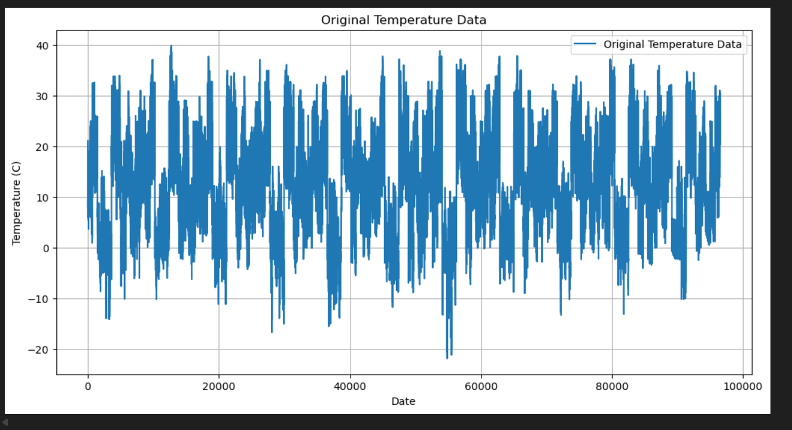
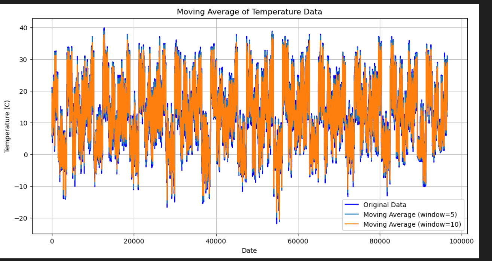
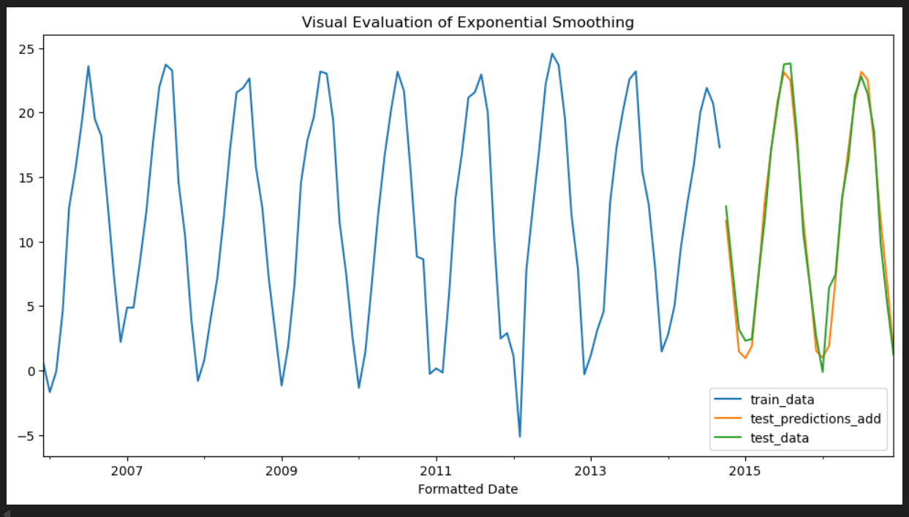
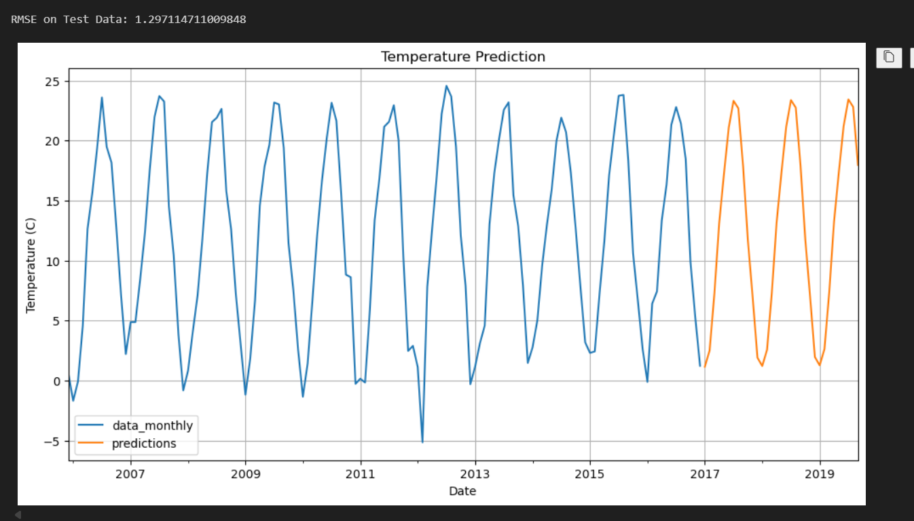

## **Ex.No: 08  –  MOVING AVERAGE MODEL AND EXPONENTIAL SMOOTHING**

### **Date: 22-10-2025** 

---

### **AIM:**

To implement the Moving Average Model and Exponential Smoothing using Python.

---

### **ALGORITHM:**

1. Import the necessary libraries such as NumPy, Pandas, Matplotlib, and relevant model libraries.
2. Read the weather time series data from the CSV file and display the shape and first few rows of the dataset.
3. Plot the original temperature data to visualize the trend.
4. Perform moving average transformation with window sizes 5 and 10.
5. Display the first few values of the rolling means.
6. Plot the original data along with the moving averages to visualize the smoothing effect.
7. Convert the date column to datetime format and resample the dataset to monthly mean values.
8. Split the dataset into training and testing sets (80–20 split).
9. Apply **Exponential Smoothing** (Additive Trend and Additive Seasonality) on the training data.
10. Forecast the test data and plot both predicted and actual data for visual evaluation.
11. Compute the **Root Mean Square Error (RMSE)** for performance evaluation.
12. Forecast the next 1/4 portion of the data using the final model and plot the predicted values.

---

### **PROGRAM:**

```python
import numpy as np
import pandas as pd
import matplotlib.pyplot as plt
from sklearn.preprocessing import MinMaxScaler
from statsmodels.tsa.holtwinters import ExponentialSmoothing
from sklearn.metrics import mean_squared_error
import warnings
warnings.filterwarnings('ignore')

# -----------------------------
# Load dataset
# -----------------------------
data = pd.read_csv('weatherHistory.csv')
weather_data = data[['Temperature (C)']]

print("Shape of the dataset:", weather_data.shape)
print("First 10 rows of the dataset:")
print(weather_data.head(10))

# -----------------------------
# Original Data Plot
# -----------------------------
plt.figure(figsize=(12, 6))
plt.plot(weather_data['Temperature (C)'], label='Original Temperature Data')
plt.title('Original Temperature Data')
plt.xlabel('Date')
plt.ylabel('Temperature (C)')
plt.legend()
plt.grid()
plt.show()

# -----------------------------
# Moving Average
# -----------------------------
rolling_mean_5 = weather_data['Temperature (C)'].rolling(window=5).mean()
rolling_mean_10 = weather_data['Temperature (C)'].rolling(window=10).mean()

print("First 10 values of rolling mean (window=5):\n", rolling_mean_5.head(10))
print("First 20 values of rolling mean (window=10):\n", rolling_mean_10.head(20))

plt.figure(figsize=(12, 6))
plt.plot(weather_data['Temperature (C)'], label='Original Data', color='blue')
plt.plot(rolling_mean_5, label='Moving Average (window=5)')
plt.plot(rolling_mean_10, label='Moving Average (window=10)')
plt.title('Moving Average of Temperature Data')
plt.xlabel('Date')
plt.ylabel('Temperature (C)')
plt.legend()
plt.grid()
plt.show()

# -----------------------------
# Resample monthly mean
# -----------------------------
data['Formatted Date'] = pd.to_datetime(data['Formatted Date'], errors='coerce', utc=True)
data.set_index('Formatted Date', inplace=True)
data_monthly = data['Temperature (C)'].resample('MS').mean()

# -----------------------------
# Train-test split (80-20)
# -----------------------------
x = int(len(data_monthly) * 0.8)
train_data = data_monthly[:x]
test_data = data_monthly[x:]

# -----------------------------
# Exponential Smoothing (Additive Trend + Additive Seasonality)
# -----------------------------
model_add = ExponentialSmoothing(
    train_data, 
    trend='add', 
    seasonal='add',  
    seasonal_periods=12
).fit()

test_predictions_add = model_add.forecast(steps=len(test_data))

ax = train_data.plot(figsize=(12, 6))
test_predictions_add.plot(ax=ax)
test_data.plot(ax=ax)
ax.legend(["train_data", "test_predictions_add", "test_data"])
ax.set_title('Visual Evaluation of Exponential Smoothing')
plt.show()

# -----------------------------
# RMSE on Test Data
# -----------------------------
rmse = np.sqrt(mean_squared_error(test_data, test_predictions_add))
print("RMSE on Test Data:", rmse)

# -----------------------------
# Forecast next 1/4 of the data
# -----------------------------
model_final = ExponentialSmoothing(
    data_monthly, 
    trend='add', 
    seasonal='add', 
    seasonal_periods=12
).fit()

predictions = model_final.forecast(steps=int(len(data_monthly)/4))

ax = data_monthly.plot(figsize=(12, 6))
predictions.plot(ax=ax)
ax.legend(["data_monthly", "predictions"])
ax.set_xlabel('Date')
ax.set_ylabel('Temperature (C)')
ax.set_title('Temperature Prediction')
plt.grid()
plt.show()
```

---

### **OUTPUT:**



* **Moving Average Plot:** 




* **Exponential Smoothing Plot:** 




* **RMSE Value:** 



---

### **RESULT:**

Thus, the Moving Average Model and Exponential Smoothing were successfully implemented using Python, and the temperature trend and forecasts were effectively visualized.

